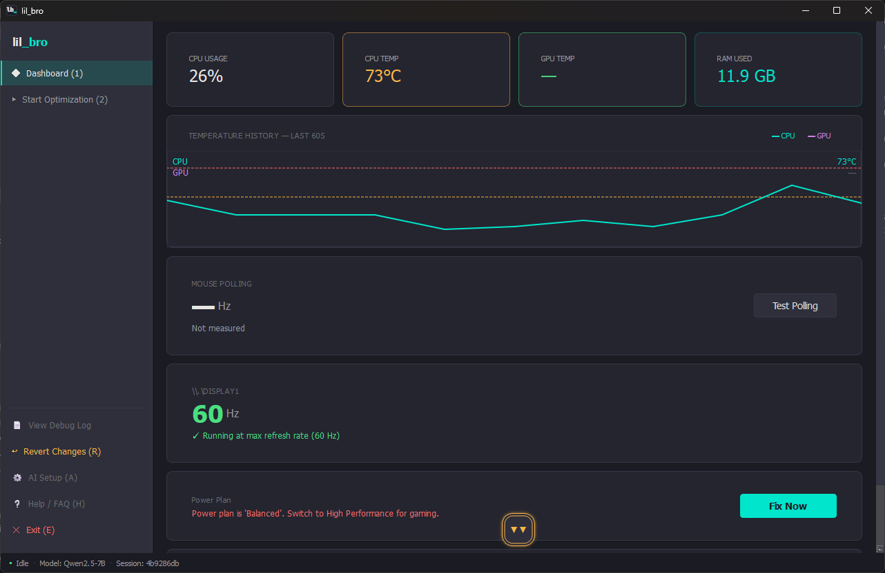
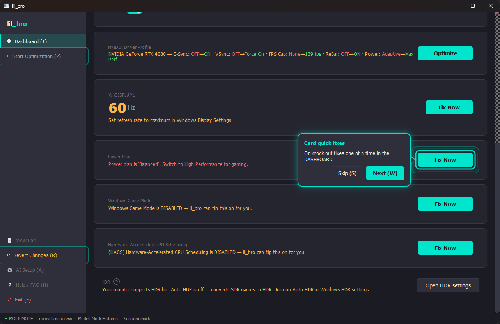

# lil_bro 🎮

A **local, privacy-first AI agent** that optimizes your gaming PC for peak performance.



## What It Does

- 🔍 **Detects misconfigurations** — monitor refresh rates, mouse polling, G-Sync, power plans, XMP/EXPO, NVIDIA GPU profiles
- 🎮 **Optimizes GPU settings** — NVIDIA Profile Inspector integration for driver-level perf tuning (shader cache, power mgmt, clocks)
- 🧹 **Debloats your system** — clears temp files, old shader caches, disables telemetry hogs
- 🌡️ **Monitors thermals** — real-time CPU/GPU temperature tracking during benchmarks
- 🤖 **AI-powered analysis** — local LLM (Qwen2.5-Coder-7B) reasons about your system and proposes fixes
- ↩️ **One-command revert** — session manifest tracks every change; undo all fixes or fall back to Windows System Restore
- 🔒 **100% offline** — no data leaves your device, ever

## Privacy Guarantee

All processing happens locally. The only external calls are optional driver version checks against vendor websites (NVIDIA/AMD/Intel) and the one-time AI model download on first run (skippable).

## Requirements

lil_bro ships as a **single, self-contained `.exe`** — there is nothing extra to install:

- **Windows 10 (build 1903 / version 18362) or newer**, or Windows 11. 64-bit.
- **Run as Administrator.** The `.exe` self-elevates via a UAC prompt on launch — expected and required to read sensors and apply system tweaks.
- **No separate runtimes needed.** Python, the Qt UI, the .NET 8 thermal sidecar, and the Visual C++ runtime are all bundled inside the download. You do **not** need to install .NET, Python, or the VC++ Redistributable separately.
- The **PawnIO** sensor driver installs automatically (with admin) on first run — no manual step.

## Status

🟢 **v0.5.0.1 — Dashboard fix cards + one-click optimization** — Full windowed app with a live dashboard (thermals, mouse polling, monitor refresh tiles) and one-click fix cards for NVIDIA driver profile, NVIDIA DLSS preset (with a Quality/FPS switch), Power Plan, Game Mode, and monitor refresh rate — each approval-gated, revertible, and showing live "Applying…" feedback while it runs. Optimization pipeline with phase-card progress and a batch fix selection dialog; session-level revert with a Windows System Restore fallback. CLI mode preserved via `--terminal`. 1106 tests passing.

## Getting Started

1. **Download** `lil_bro.exe` from [Releases](https://github.com/anthropics/lil_bro/releases).
2. **Double-click** to launch. A **UAC (User Access Control) prompt** appears — this is expected and required: lil_bro needs admin rights to read sensors and apply system tweaks.
3. **The first launch shows a quick tour.** Arrow callouts point at the two things you'll use. Press **W** (or click **Next**) to step through, **Esc** to skip. Replay it anytime from **❔ Help / FAQ (H)** in the sidebar.

lil_bro has two surfaces — a live **Dashboard** for quick one-off fixes, and **Start Optimization** for a full guided pass.

### The Dashboard — live stats + one-click quick fixes

The home view (**◆ Dashboard (1)**) shows live CPU/GPU temperatures, RAM, and mouse polling. When something is holding back your FPS — a monitor stuck below its max refresh rate, a non-performance power plan, Game Mode off, or an unoptimized NVIDIA driver profile / DLSS preset — a **quick-fix card** appears with a one-click **Fix Now** / **Apply** button. Every fix is approval-gated, shows live "Applying…" feedback, and is revertible. Use these anytime; no full run required.



When everything is already healthy, the cards step back and the Dashboard is simply your live monitor:


### Start Optimization — the guided pipeline

**▶ Start Optimization (2)** runs the full guided pass:

1. **Restore point first** — a Windows System Restore Point is created before anything changes.
2. **Scan** — a deep hardware + configuration scan (display, power, GPU, thermals, NVIDIA profile, and more).
3. **Propose** — lil_bro lists the fixes it recommends in a batch selection dialog.
4. **Approve** — you choose exactly which fixes to apply. Nothing changes without your OK.
5. **Apply + benchmark** — the selected fixes run, with an optional before/after benchmark.

Changed your mind? **↩ Revert Changes (R)** rolls back everything from the session in one click, with the restore point as the safety net behind it.

### CLI Mode (Terminal)

For a command-line interface instead of the graphical app:
```
lil_bro.exe --terminal
```

## Debugging

**GUI mode** writes `lil_bro_debug.log` only when something goes wrong: a clean run leaves no file, but an uncaught exception is logged (stamped with the app version) to the working directory. Pass `--debug` for the full verbose log from startup. Open either log from the sidebar — **View Log** (the action audit log) is always shown; **View Debug Log** appears under `--debug`.

**Terminal mode** with `--debug` activates full DEBUG-level logging:
```
lil_bro.exe --terminal --debug
```

**Windowed mode** with `--debug` activates DEBUG-level logging to file (no console):
```
lil_bro.exe --debug
```

Both log files are preserved after each run:
- `lil_bro_actions.log` — audit trail of every system modification lil_bro made
- `lil_bro_debug.log` — process lifecycle, GUI startup, pipeline flow, and exception traces

## Troubleshooting

**Temperatures don't show up / the thermal card is "offline".** lil_bro runs a small bundled helper (`lhm-server.exe`) to read your sensors. If the temperature card shows a cause instead of a graph, it's almost always one of:

- **Antivirus blocked or quarantined the helper.** It's an unsigned, self-extracting executable that installs a driver, which some antivirus tools flag. Add an exclusion for `lhm-server.exe` (and the lil_bro folder), then click **Retry** on the temperature card.
- **Port 8085 is in use.** The helper serves sensor data on `localhost:8085`. Close whatever is using that port (lil_bro names it when it can), then **Retry**.
- **The PawnIO sensor driver was blocked.** On systems with Secure Boot / strict driver signing, the kernel sensor driver can be refused. Temperatures may be limited; **Retry** re-attempts the install.

lil_bro does **not** download anything to fix these — it tells you the cause and lets you **Retry** once you've cleared it. Everything stays offline.

## Further Reading

- **[DEVELOPMENT.md](DEVELOPMENT.md)** — Architecture, developer setup, test commands, and build instructions
- **[CONTRIBUTING.md](CONTRIBUTING.md)** — How to report bugs, submit pull requests, and contribute

## License

This project is licensed under the **MIT License**. See [LICENSE.md](LICENSE.md) for full details.

Copyright © 2026 cattboy

## Code of Conduct

We are committed to providing a welcoming, inclusive, and harassment-free environment for all contributors and users. Please see [CODE_OF_CONDUCT.md](CODE_OF_CONDUCT.md) for our full Code of Conduct and enforcement procedures.
